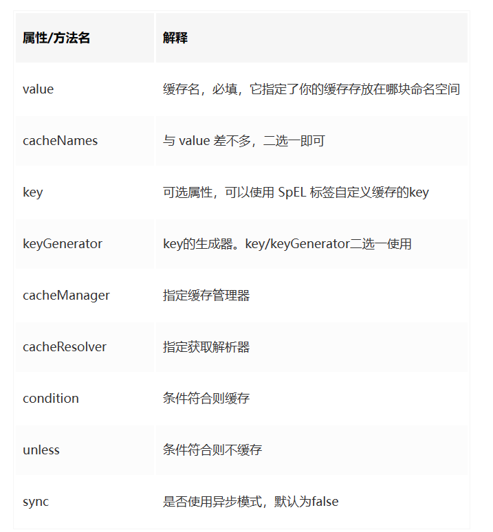
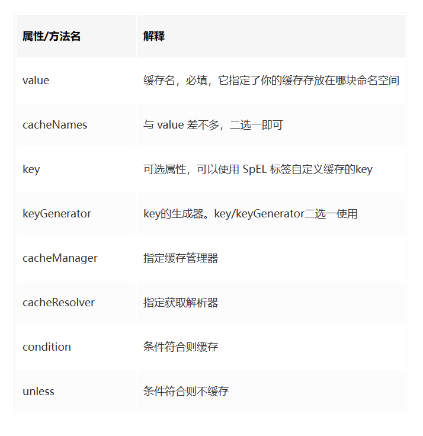
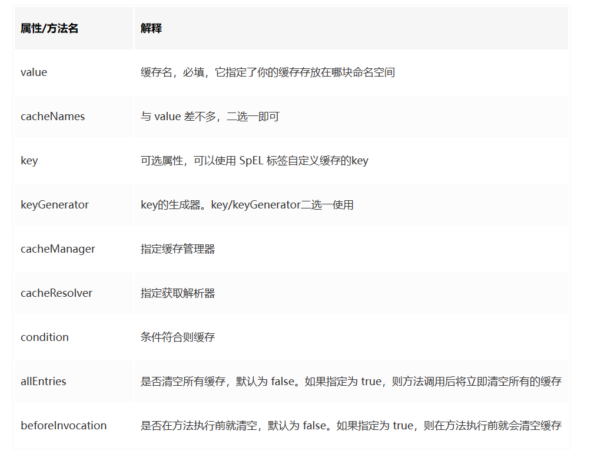

## SpringCache 整合笔记

### 1、Cacheable注解


> 首先会判断方法是否被缓存，如果被缓存了直接从缓存中取数据，否则查询数据库并将结果进行缓存。
> 一般用于 **查询** 方法

### 2、CachePut注解


> 当满足缓存条件，直接将方法的 结果 进行缓存，每次调用方法都会将结果进行缓存。
> 一般用于 **插入** 方法

### 3、CacheEvict注解


> 默认 会将传入的 缓存key 进行清除。
> 一般用于 **修改** 和 **删除** 方法

### 4、SpringConfig注解
> 可以作用于类上，指定字段cacheNames，为整个类指定缓存名称。如果你在你的方法依旧写上了value，那么依然以方法的value值为准

```java

@CacheConfig(cacheNames = "TestController")
public class TestController {
    // 为整个 TestController 指定 cacheName
}
```

